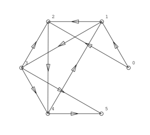
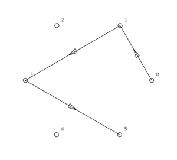
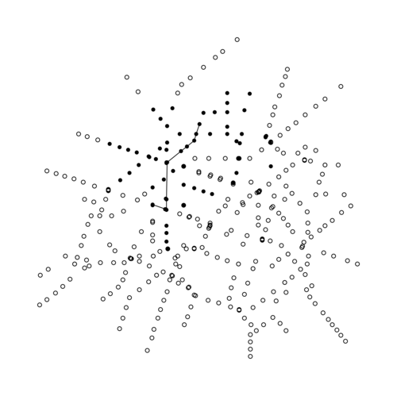
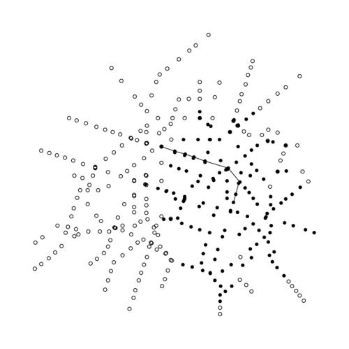
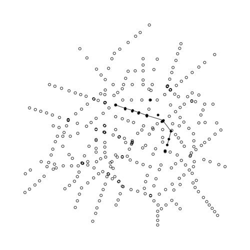
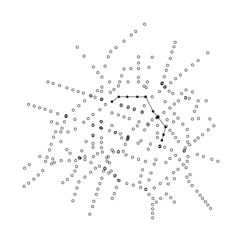

# Rapport atelier graphes et algos
## Partie I
### 1.2.1

Voici l'algorithme de symétrisation du programme 1.2.1 :

```c
graphe * Sym(graphe * g)
/* ====================================================================== */
{
  graphe *g_1;
  int nsom, narc, k, i, j;
  pcell p;

  nsom = g->nsom;
  narc = g->narc;
  g_1 = InitGraphe(nsom, narc);

  for (i = 0; i < nsom; i++) /* pour tout i sommet de g */
    for (j = 0; j < nsom; j++) /* pour tout j sommet de g */
      if (EstSuccesseur(g, i, j))
        AjouteArc(g_1, j, i);
  return g_1;
} /* Sym() */
```

Le double parcours des noeuds du graphe a une complexité temporelle écrasante de $nsom^2$, ce qui ne fait pas très sérieux pour de gros graphes.

### 1.2.2

On fait une série de tests du programme avec l'algorithme de symétrisation en comléxité carrée.

| sommets | arcs | temps (s) |
|:-------:|:----:|:-----:|
|   0     |   0  | 5e-06 |
|   10    |  1   | 5e-06 |
|   100   |  1   | 0.000245  |
|   1000  |  1   | 0.012583  |
|   10000 |  1   | 0.687257  |
|  100    | 10   | 0.000228  |
|  100    |   100   | 0.000241  |
|  10000  |   10    | 0.66866 |
|  10000  |   100   | 0.669726 |
|  10000  |   1000  |  0.683185 |
|  10000  |   10000 | 0.821921 |
|  10000  |   100000 | 3.38022 |

### 1.2.3

On rend l'algorithme qui construit le symétrique d'un graphe linéaire en parcourant non pas les sommets mais les arcs.

```c
graphe * Sym(graphe * g)
/* ====================================================================== */
{
  graphe *g_1;
  int nsom, narc, k, i, j;
  pcell p;

  nsom = g->nsom;
  narc = g->narc;
  g_1 = InitGraphe(nsom, narc);

  for (i = 0; i < narc; i++)
    AjouteArc(g_1, g->queue[i], g->tete[i]);
    
  return g_1;
} /* Sym() */
```

On refait la même série de test avec cette fois cet algorithme linéaire.

| sommets | arcs | temps (s) |
|:-------:|:----:|:-----:|
|  0      |  0     | 5e-06 |
|  10     |  1     | 3e-06 |
|  100    |  1     | 4e-06   |
|  1000   |  1     | 1.7e-05  |
|  10000  |  1     | 6.8e-05   |
|  100    | 10     | 6e-06   |
|  100    | 100    | 1.3e-05  |
|  10000  | 10     | 0.000131  |
|  10000  | 100    | 9.8e-05 |
|  10000  | 1000   |  0.000201  |
|  10000  | 10000  | 0.000826 |
|  10000  | 100000 | 0.002681  |

On le sent bien le carré en moins.


## Partie II

```c
void Dijkstra(graphe * g, int i)
{
  int nsom, narc, k, x, y, j;
  pcell p;
  nsom = g->nsom;
  narc = g->narc;
  long int* pi = g->v_sommets; // parce que c'est plus sympa à taper
  long int* s = (long int*) malloc(nsom*sizeof(long int));
  long int x_min;
  // on initie tous les noeuds à -1
  for (int som = 0;
       som < nsom;
       som++ )
  {
    pi[som] = -1; // on va dire que +inf = -1
  }
  pi[i] = 0;
  s[i] = 1;

  k = 1;
  x = i;
  
  // début des itérations
  while (k < nsom && pi[x] != -1)
  {


    // on écrit sur les éventuels noeuds non fixés encore
	// images de x par gama
    for (p = g->gamma[x]; p != NULL; p = p->next) 
    {
      y = p->som;

      if (s[y] == 0 )
      {
      
  	    int sum = pi[x] + p->v_arc;  //poid en x + celui de l'arc
		if (pi[y] < 0 || pi[y] >= sum)
          pi[y] = sum;
      }
    }


	// on calcule le poid minimum des noeuds non-fixés
    int min = -1;
    for (y = 0; y < nsom; y++)
    {
      if ( !s[y] && pi[y] >= 0 &&
	       (pi[y] < min || min < 0) )
      {
	    min = pi[y];
      }
    }


    // le noeud non-fixé de poid minimal est fixé et
	// selectionné comme x de la prochaine itération
	
	x_min = x;
    for (y = 0; y < nsom; y++)
    {
      if ( !s[y] && pi[y] >= 0 &&
	   (pi[y] < pi[x_min] || s[x_min])  )
      {
	x_min = y;
      }
    }
    s[x] = 1;
    x = x_min;
    
    k++;
  }
    
  free(s);
}

```

## Partie III

```c
graphe *
shortest_path( graphe * g,
	       int d,
	       int a )
{
  graphe * g_1;
  graphe * g_sym;
  long int* pi = g->v_sommets;
  pcell p;

  long int nsom, narc;
  nsom = g->nsom;
  narc = g->narc;
  g_1 = InitGraphe(nsom, narc);
  Dijkstra(g, d);
  
  if (pi[a] == -1)
    return g_1;

  g_sym = Sym(g);
  

  long int x;
  long int y;

  x = a;
  
  while (x != d)
  {
    for (p = g_sym->gamma[x]; p != NULL; p = p->next) 
    {
      y = p->som;
      if (pi[x]-pi[y] == p->v_arc)
      {
	AjouteArcValue( g_1,
			y,
			x,
			p->v_arc );
	x = y;
	break;
      }
    }
    //    break;
  }
  TermineGraphe(g_sym);

  return g_1;
}

```

En testant sur ce graphe:

6 10  
arcs values  

| queue | tête | poid |
|:---:|:---:|:---:|
| 0 | 1 | 2 |
| 0 | 2 | 8 |
| 1 | 2 | 5 |
| 1 | 3 | 1 |
| 2 | 4 | 1 |
| 3 | 2 | 4 |
| 4 | 1 | 3 |
| 3 | 4 | 1 |
| 3 | 5 | 1 |
| 4 | 5 | 1 |




Le programme construit le bon chemin, et ça, c'est bien.


## Partie IV


Le graphe metro_complet et plutôt important


On essaie notre programme avec plusieurs points de départs et d'arrivée.
Les sommets noirs sont ceux exploré par notre dijkstra.

Pour aller du sommet 0 à 5:  


Pour aller du sommet 0 à 50:  


Pour aller du sommet 40 à 60:  



## Parties V-VI

Dijkstra marche plutôt bien, mais beaucoup de noeuds sont explorés avant de trouver le bon chemin.
On va donc essayer une autre stratégie, ne plus prendre en compte que le poid minimum des noeuds de proche en proche, mais on va ajouter à celà la proximité géographique des noeuds au but. Ça sera une implémentation de l'algorithme A*


```c

double // retourne la distance entre i et j dans g
heuristic_dist(graphe * g, int i, int j)
{
  double dx = g->x[i] - g->x[j];
  double dy = g->y[i] - g->y[j];
  if (dx < 0)
    dx = -dx;
  if (dy < 0)
    dy = -dy;
  return dx+dy; // il semble peu avantageux de calculer une racine carrée, la norme N1 suffit comme critère de proximité.
}

long // retourne le poid du noeud x avec critère géographique
heuristic(graphe * g, int x, int but, int coeff)
{
  double d = heuristic_dist(g, x, but);
  return g->v_sommets[x]+ floor(d)*coeff;
  // coeff sert à donner plus ou moins d'importance au critère géographique
}


char * // notre Dijkstra_eco modifié pour en faire un A*
A_star(graphe * g, int i, int but, int coeff)
{
  int nsom, narc, k, x, y, j;
  pcell p;
  nsom = g->nsom;
  narc = g->narc;
  long int* pi = g->v_sommets; // parce que c'est plus sympa à taper
  char* s = (char*) malloc(nsom*sizeof(char));
  long int x_min;
  

  for (int som = 0;
       som < nsom;
       som++ )
  {
    pi[som] = -1; // on va dire que +inf = -1
  }
  pi[i] = 0;
  s[i] = 1;

  k = 1;
  x = i;
  
  while (k < nsom && pi[x] != -1)
  {
    for (p = g->gamma[x]; p != NULL; p = p->next) 
    {
      y = p->som;

      if (s[y] == 0 )
      {
      
	int sum = pi[x] + p->v_arc;  //poid en x + celui de l'arc
	if (pi[y] < 0 || pi[y] >= sum)
	  pi[y] = sum;
      }
      
    }

    // ce qui a été modifié par rapport à Dijkstra_eco
    x_min = x;
    long v_min = heuristic(g, x, but, coeff);
    long v_min_1;
    for (y = 0; y < nsom; y++)
    {
      v_min_1 = heuristic(g, y, but, coeff);
      printf("%d %d %d %d \n", x_min, y, v_min, v_min_1);
      if ( !s[y] && pi[x] >= 0 &&
	   (v_min_1 < v_min || s[x_min]) && pi[y] >= 0 )
      {
	x_min = y;
	v_min = v_min_1;
      }
    }
    
    s[x] = 1;
    if (x == but)
      return s;
    
    x = x_min;

    
    k++;
  }
  return s;
}

```

Avec Dijkstra:  
  
Avec coeff = 1:  
  
Avec coeff = 2:  
  
Avec coeff = 3:  
  
Avec coeff = 4:  
  

On remarque qu'à partir d'un certain coeff, le chemin n'est plus optimal.
A* privilégie la rapidité d'exécution à la qualité du résultat.
coeff = 3 semble être un bon compromis néanmoins.


## Partie 7

On cherche à faire une implémentation de tas binaires de sommets triés par poids.
Il suffit de stocker le numéro de chaque sommet dans les noeuds du tas et de mettre le graphe en paramètre des fonctions nécessitant l'accès aux poids, ainsi notre arbre reste simple.

Voici la structure:
```c
typedef struct _noeud_tas_binaire
{
  int sommet;
  struct _noeud_tas_binaire * gauche;
  struct _noeud_tas_binaire * droite;
} noeud_tas_binaire, *tas_binaire;


```

J'implémente ensuite toute les fonctions qui pourraient être utiles (cf tas_binaire.h)


